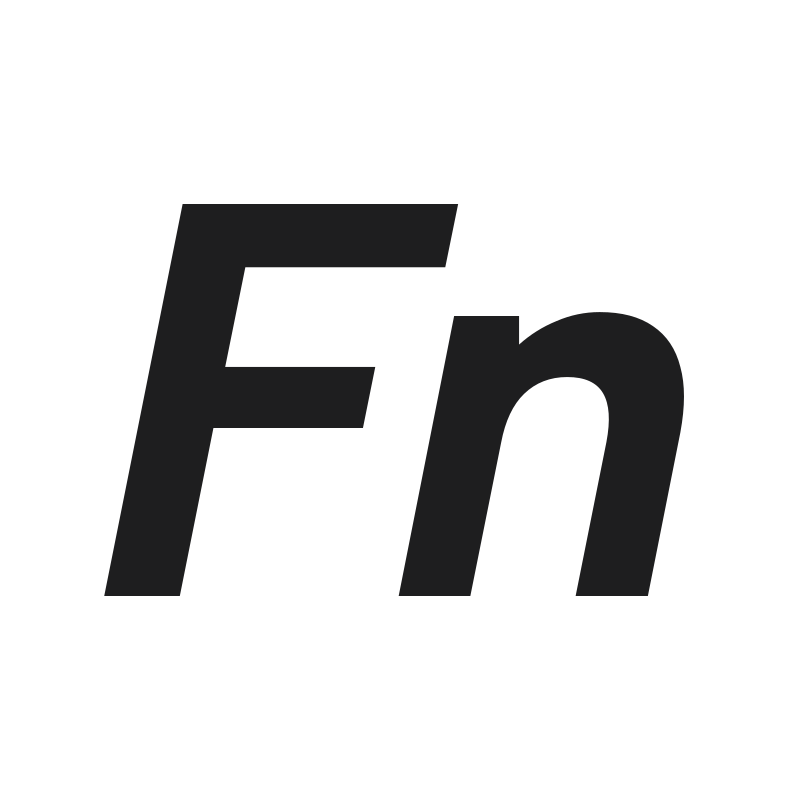

# fn-code.com

This page serves to introduce **me**, my **development skills**, as well as my personal **projects**.

✨ **[Live portfolio](https://fn-code.com)**

Previous Version: [v1](https://github.com/floriannussbaum/vue-portfolio)

## 🏗 Built with

[](http://vuejs.org/)
[](https://nuxt.com)
[](https://tailwindcss.com/)

### Node version 24.2.0

## Usage

### Installation

Make sure to install dependencies:

```bash
pnpm install
```

### Development

Start the development server on `http://localhost:3000`:

```bash
pnpm dev
```

### Production

Build the application for production:

```bash
pnpm generate
```

## License

[MIT](./LICENSE) License © 2026-PRESENT [Florian Nußbaum](https://github.com/floriannussbaum)
